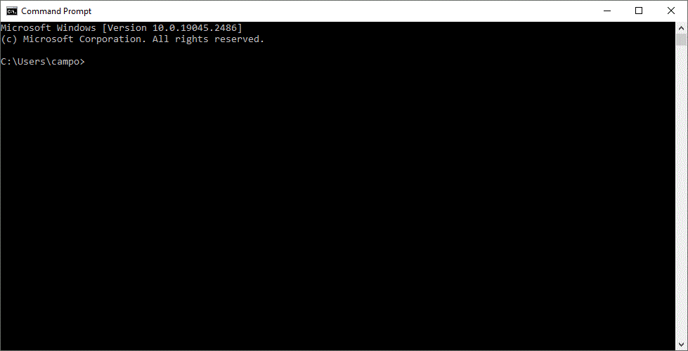

# Command Prompt (CMD)

To open cmd, click in start menu and search <b>cmd</b>. The image bellow show the initial screm of the Command Prompt

|  |
| :-------------: |
|  *CMD Screem*   |

## Basic commands

### DATE
Show the actual date in standard format and asker by new date.
Just press ENTER to skip replace asker.

``` bash
> date
The current date is: Sun 04/23/2023
Enter the new date: (mm-dd-yy)

```


### TIME
Show the actual time in standard format and asker by new time. Just press ENTER to skip replace asker

``` bash
>time
The current time is: 17:04:45.74
Enter the new time:

```

### VER
Show the system version.
``` bash
>ver

Microsoft Windows [Version 10.0.19045.2486]

```

### DIR
Show the folder content, number of files and space in disc.
``` bash
>ver
 Volume in drive C has no label.
 Volume Serial Number is 5CC2-A063

 Directory of C:\Users\campo

11/16/2022  05:04 PM    <DIR>          .
11/16/2022  05:04 PM    <DIR>          ..
11/24/2021  08:10 AM             6,884 -1.14-windows.xml
11/16/2022  05:04 PM    <DIR>          .cache
10/14/2021  08:24 PM    <DIR>          .idlerc
10/12/2022  08:21 AM    <DIR>          .matplotlib
06/18/2021  02:12 PM    <DIR>          .vscode
05/31/2021  10:24 PM    <DIR>          3D Objects
05/31/2021  10:24 PM    <DIR>          Contacts
04/01/2023  06:42 PM    <DIR>          Desktop
08/06/2022  07:15 AM    <DIR>          Documents
03/11/2023  12:51 PM    <DIR>          Downloads
05/31/2021  10:24 PM    <DIR>          Favorites
05/31/2021  10:24 PM    <DIR>          Links
06/02/2021  09:10 AM                22 miktex-console.lock
06/22/2021  01:47 PM    <DIR>          Music
03/28/2023  07:16 AM    <DIR>          OneDrive
04/23/2023  04:13 PM    <DIR>          Pictures
05/31/2021  10:24 PM    <DIR>          Saved Games
05/31/2021  10:25 PM    <DIR>          Searches
08/28/2022  08:41 AM    <DIR>          Videos
               2 File(s)          6,906 bytes
              19 Dir(s)  51,312,812,032 bytes free

```

This command accept the next parameters of configuration:
  
*  **/p**: split information if it is very large;
*  **/w**: show content in columns;
*  **/o**: order content by alphabetical.

### CLS
Clear  screen.

### MKDIR (or MD)
Create new folder.

``` bash
C:\Users\campo\Documents\CMD>dir
 Volume in drive C has no label.
 Volume Serial Number is 5CC2-A063

 Directory of C:\Users\campo\Documents\CMD

04/23/2023  05:22 PM    <DIR>          .
04/23/2023  05:22 PM    <DIR>          ..
               0 File(s)              0 bytes
               2 Dir(s)  51,309,461,504 bytes free

C:\Users\campo\Documents\CMD>mkdir temp

C:\Users\campo\Documents\CMD>dir
 Volume in drive C has no label.
 Volume Serial Number is 5CC2-A063

 Directory of C:\Users\campo\Documents\CMD

04/23/2023  05:22 PM    <DIR>          .
04/23/2023  05:22 PM    <DIR>          ..
04/23/2023  05:22 PM    <DIR>          temp
               0 File(s)              0 bytes
               3 Dir(s)  51,309,449,216 bytes free

```

### CHDIR (or CD)
Change actual folder.

``` bash
C:\Users\campo\Documents\CMD>cd temp

C:\Users\campo\Documents\CMD\temp>

```

### RMDIR (or RD)
Delete folder (if it is empy!).

``` bash
C:\Users\campo\Documents\CMD>dir
 Volume in drive C has no label.
 Volume Serial Number is 5CC2-A063

 Directory of C:\Users\campo\Documents\CMD

04/23/2023  05:22 PM    <DIR>          .
04/23/2023  05:22 PM    <DIR>          ..
04/23/2023  05:22 PM    <DIR>          temp
               0 File(s)              0 bytes
               3 Dir(s)  51,309,449,216 bytes free

C:\Users\campo\Documents\CMD>rd temp

C:\Users\campo\Documents\CMD>dir
 Volume in drive C has no label.
 Volume Serial Number is 5CC2-A063

 Directory of C:\Users\campo\Documents\CMD

04/23/2023  05:27 PM    <DIR>          .
04/23/2023  05:27 PM    <DIR>          ..
               0 File(s)              0 bytes
               2 Dir(s)  51,310,952,448 bytes free

```

### TREE
Show tree struture folder and subforder organization.

``` bash
D:\FCF\Projects\Articles\programation\languagem_python> tree
Folder PATH listing for volume Novo volume
Volume serial number is 0881-32A4
D:.
└───ExercisesEduardo
    ├───beeware
    │   ├───beeware-venv
    │   │   ├───bin
    │   │   ├───include
    │   │   │   ├───pycairo
    │   │   │   └───pygobject-3.0
    │   │   ├───lib
    │   │   │   ├───pkgconfig
    │   │   │   └───python3.6
    │   │   │       └───site-packages
    │   │   │           ├───arrow
    │   │   │           │   └───__pycache__
```

### RENAME (or REN)
Rename file/folder.

``` bash
C:\Users\campo\CMD EXAMPLES>ren temp.txt TEMP.md
```

### TYPE
Show file content. Don't work with imagens or others extensions.

``` bash
C:\Users\campo\CMD EXAMPLES>type text.txt
They live on the other side of the lake. She has three other brothers.
C:\Users\campo\CMD EXAMPLES>type Dragon.jpg
 Ï Ó►JFIF☺☺☺dd ß`ExifII☻1☺☻&iç♦☺.Google♥É♦0220☻á♦☺♣♥á♦☺ ♥ █C☻☺☺☻☺☺☻☻☻☻☻☻☻☻♥♣♥♥♥♥♥♠♦♦♥♣♠♠♂


♀♫♂♀♀♀ █C☺☻☻☻♥♥♥♠♥♥♀♀♀♀♀♀♀♀♀♀♀♀♀♀♀♀♀♀♀♀♀♀♀♀♀♀♀♀♀♀♀♀♀♀♀♀♀♀♀♀♀♀♀♀♀♀♀♀♀♀ └♥ ♣♥☺◄☻◄☺♥◄☺ ─▲☻☻♥☺☺☺☺♦♣♥♠☻☺
 ─O►☺♥♥♥☻♦♦♦♦♦♦♦♥☻☼☺☻♥♦♣◄♠↕!‼1"AQ¶aq#2æ§BRí     3▒┴▬$bÐCSrß↨%4é
cÆó­±↑Ds&5Tâú┬Ë ─☺☻♥☺☺☺♥☺☻♦♣♠─8◄☻☻☺♥♦☺♥♥♥♥♥♦♥☺☺☻☺♥↕♦◄"‼!12BAQR♣¶a#3qbüæ§í­Cr▒ß┴бéS ┌♀♥☺☻◄♥◄?°‗ß)█ö7ÉýXÊD_µi↔:·AÓ╔msó▒►-õ♠Êö~ò»qþþ@☻[┘À┼║Ñ♂┌
```
### COPY 
Copy a file to another folder
``` bash
C:\Users\campo\CMD EXAMPLES>copy text.txt Folder
        1 file(s) copied.
```
 You can copy multiples files using the caracter *.

 ``` bash
C:\Users\campo\CMD EXAMPLES>copy *.txt Folder
        1 file(s) copied.
```

All files with extension ".txt" will be copied to "Folder".

### TITLE
Change name of the cmd window.

``` bash
C:\Users\campo\CMD EXAMPLES\Folder>TITLE CMD IS EASY
```
|     |
| :-----------------: |
| *CMD title changed* |

### ECHO
Show if system mensagens is activate. 
``` bash
C:\Users\campo>ECHO
ECHO is on.
```
Shows a mensagem that typed forward.
``` bash
C:\Users\campo>ECHO "Hellow wold!"
"Hellow wold!"
```
Show the windows variable of ambient.
``` bash
C:\Users\campo>echo %path%
C:\Program Files (x86)\Common Files\Oracle\Java\javapath;C:\Windows\system32;C:\Windows;C:\Windows\System32\Wbem;C:\Windows\System32\WindowsPowerShell\v1.0\;C:\Windows\System32\OpenSSH\;C:\Program Files\MATLAB\R2021a\bin;C:\Users\campo\AppData\Local\Programs\Python\Python39\Scripts\;C:\Users\campo\AppData\Local\Programs\Python\Python39\;C:\Users\campo\AppData\Local\Microsoft\WindowsApps;C:\Users\campo\AppData\Local\Programs\MiKTeX\miktex\bin\x64\;C:\Users\campo\AppData\Local\Programs\Microsoft VS Code\bin
```

### SET
Create system variables.
``` bash
C:\Users\campo>set x="Hi, I'm here."

C:\Users\campo>echo %x%
"Hi, I'm here."
```
### IF
Run command if expression is true.
```bash
C:\Users\campo>echo %x%
"Hi, I'm here."

C:\Users\campo>if %x%=="Hi, I'm here." echo (is true)
(is true)

C:\Users\campo>if %x%=="Hi" echo (is true)

C:\Users\campo\CMD EXAMPLES> if EXIST text.txt echo true
true
```

### ELSE
Run command 1 if expression is true or run command 2 if false.
```bash
C:\Users\campo\CMD EXAMPLES>echo %x%
"Hi, I'm here."

C:\Users\campo\CMD EXAMPLES>if %x%=="Hi, I'm here." (echo is true) else (echo is false)
is true

C:\Users\campo\CMD EXAMPLES>if %x%=="Hi" (echo is true) else (echo is false)
is false
```

### Copy con
Create file with text. Press Ctrl+Z to exit text editor.
``` 
C:\Users\campo\CMD EXAMPLES>copy con temp.txt
Hi, I'm here!
^Z
        1 file(s) copied.

C:\Users\campo\CMD EXAMPLES>type temp.txt
Hi, I'm here!
```

## File In Lots
Is a file with sequential commands to cmd. Is very usefull to automate tasks dally. The file's extension is ".bat".
```  
C:\Users\campo\CMD EXAMPLES>copy con code1.bat
echo off
cls
echo. 
echo =====================
echo   My first program
echo =====================
^Z
        1 file(s) copied.

C:\Users\campo\CMD EXAMPLES> code1.bat
```

```  
=====================
  My first program
=====================

C:\Users\campo\CMD EXAMPLES>
```

The command ```echo off``` concealed the  text ```C:\Users\campo\CMD EXAMPLES>``` in each line executed. And ```echo.``` show empty line.

### Arguments
We can pass arguments to code when call it.

```  
C:\Users\campo\CMD EXAMPLES>copy con code2.bat
echo off
echo ==============
echo  Name  : %1
echo  Fone  : %2
echo  email : %3
echo ==============
^Z
        1 file(s) copied.

C:\Users\campo\CMD EXAMPLES>code2 Fabio 5555-5555 fabioIF@gmail.com

C:\Users\campo\CMD EXAMPLES>echo off
==============
 Name  : Fabio
 Fone  : 5555-5555
 email : fabioIF@gmail.com
==============
```
### > (Outgoing Redirecting)
Place after the command to redirect the output of the command that previously appeared on the screen to a file. Caution, this command replace file content.
```
C:\Users\campo\CMD EXAMPLES>echo "Hellow World!" > file.txt

C:\Users\campo\CMD EXAMPLES>type file.txt
"Hellow World!"

C:\Users\campo\CMD EXAMPLES>echo "Goodbye World!" > file.txt

C:\Users\campo\CMD EXAMPLES>type file.txt
"Goodbye World!"
```
If you want to add content to the file without replacing its contents, use >>.

```
C:\Users\campo\CMD EXAMPLES>echo "Hellow World!" > file.txt

C:\Users\campo\CMD EXAMPLES>echo "Because I got the party!" >> file.txt

C:\Users\campo\CMD EXAMPLES>type file.txt
"Hellow World!"
"Because I got the party!"
```

## Using Parameters and ```>>```

This code logs user and saves in the file ```registers.txt```. 

```
C:\Users\campo\CMD EXAMPLES>copy con code3.bat
echo off
echo ==============
echo  Name  : %1
echo  Fone  : %2
echo  email : %3
echo ==============
echo.               >> registers.txt
echo ============== >> registers.txt
echo  Name  : %1    >> registers.txt
echo  Fone  : %2    >> registers.txt
echo  email : %3    >> registers.txt
echo ============== >> registers.txt
echo %1 registered!
^Z
        1 file(s) copied.

C:\Users\campo\CMD EXAMPLES>code2 Fabio 5555-5555 fabioIF@gmail.com

C:\Users\campo\CMD EXAMPLES>echo off
==============
 Name  : Fabio
 Fone  : 5555-5555
 email : fabioIF@gmail.com
==============
```

## Dictionary Windows CMD to Linux Terminal

|CMD | Terminal|Do|
|:--|:--|:--|
|```dir```|```ls```|Show files in folder|