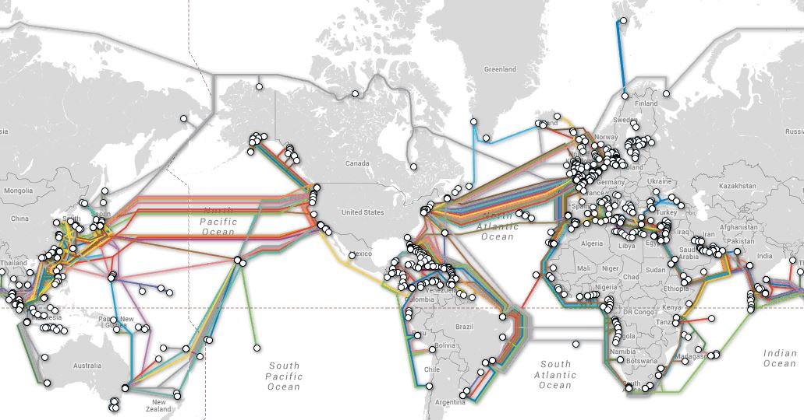

# Inteligência Artificial e o Novo Contexto da Cultura Digital

## Contexto e relevância

Tem sido intensamente aplicada por causa da imensa disponibilidade de dados existentes, denominada *Big Data*.

**Big Data**: conjuntos de dados complexos que necessitam de sistemas especialmente preparados (algoritmos) para encontrar, analisar e aproveitar as informações geradas de forma autônoma, sem intervenção humana.

A IA permite: 
* Lojistas virtuais  mapeiem os interesses dos usuários
* Em grandes empresas, IA mapeiam o estoque e as tendências de venda de um determinado produto para propor um cronograma adequado de produção.
* Os médicos contam com o suporte de aplicações em IA capazes de analisar dados genéticos, exames de imagem, históricos de saúde e comparar resultados com dados de outros pacientes, de forma a amparar e prever diagnósticos mais assertivos.

*Sociedade em rede* para as pessoas após 90 anos, e agora é *sociedade de dados* ou *economia de dados*.

## Origens da IA

A  inteligência artificial (IA) não é um tema novo. Cientistas criaram na década de 50, mas mesmo antes desse período, pensadores e filósofos da antiguidade apontavam a hipótese de uma inteligência não humana que pensasse por si própria. Aristóteles, por exemplo, refletia, na época, como seria possível acabar com a escravidão.  Leonardo da Vinci — cientista, poeta e autor em diversas artes — foi considerado como um dos precursores do conceito de inteligência artificial por ter projetado, em 1495, o que se acredita ser o primeiro robô humanoide.

* As máquinas dominarão o ser humano ou o ser humano dominará as máquinas?

**inteligência artificial (IA),** é um tipo de inteligência construída pelo ser humano para dotar a máquina de comportamentos considerados "inteligentes", equivalentes ao cérebro animal. Frase de Alan Turing. 

**Conferência de Dartmouth,**: teve com objetivo simular a inteligência, estabeleceu-se um campo de estudo na Ciência da Computação, destinado justamente a construir sistemas automatizados capazes de reproduzir traços comumente ligados aos humanos, como capacidades relacionadas à solução de problemas e o aprendizado repetitivo.

## IA e a 4ª Revolução Industrial

Os estudos em inteligência artificial têm diversos enfoques: alguns ressaltam a tentativa de reprodução das formas como os humanos pensam e sentem; outros visam a reproduzir como nos comportamos e realizamos ações.

### 1ª Revolução
                                    
Mecanização dos processos de produção: migração do processo de produção artesanal para a industrialização, por meio de inovações, como a máquina a vapor e têxtil.

### 2ª Revolução

Modernização: integração da eletricidade e modernização de equipamentos.

### 3ª Revolução

Informacional: trouxe a tecnologia da informação, as telecomunicações e a indústria de eletrônicos.

### 4ª Revolução

Inteligente: objetiva a automação a partir da integração de máquinas nos processos digitais e exploração dos dados.

É a partir da análise de uma grande quantidade de dados que a IA consegue construir a sua “inteligência”.

imitar a forma como humanos desenvolvem o conhecimento

o grande desafio da IA é depreender sentido, a partir de dados não-estruturados

* Dados estruturados: são mais fáceis de serem organizados. São aqueles comumente encontrados em planilhas organizadas por colunas e etiquetas: como uma planilha com a quantidade de carros vendidos por uma empresa, que nos diz quais são os modelos vendidos, em quais dias eles foram vendidos, etc.

* Dados não-estruturados:  não possuem uma organização a priori conhecida. Sua estrutura é flexível. É o caso de documentos de texto, por exemplo: em sua maioria, é difícil categorizar cada palavra de um texto e relacioná-la com seu contexto, com quem escreveu e em qual momento. ( redes sociais)

É a partir do cruzamento e análise dessa grande quantidade de dados que a IA poderá aprender sobre os padrões da região e fornecer previsões mais assertivas sobre o tempo.

## Como funciona a IA?

Com a IA, a automação não se restringe à execução de tarefas que antes eram manuais, mas também àquelas que requerem uma análise de grande volume de dados, incorporando “inteligência” a produtos e soluções.

a realidade da inteligência artificial não implica em termos robôs humanoides caminhando entre nós ou computadores ultra inteligentes, capazes de pensar exatamente como humanos o fazem. As aplicações de IA são mais simples do que imaginamos!

IA pode ser definida como um modelo estatístico de probabilidade que utiliza o tratamento de dados para aumentar sua eficiência de maneira crescente, sem a necessidade de intervenção humana.

* Aprendizado de máquina (*machine learning*): é o processo pelo qual uma máquina, ou seja, um sistema tecnológico, aprende a se comportar e a interpretar conteúdos. O aprendizado de máquina é o método pelo qual sistemas automatizados aprendem com os dados, identificando padrões, tomando decisões e propondo soluções por meio da construção de modelos analíticos.

* Supervisionada: em que alguém delimita para a inteligência artificial quais são as categorias e os rótulos dos dados a serem analisados.

* Não-supervisionada: em que a máquina precisa aprender sozinha quais são os padrões dos dados.

* Por reforço: em que a máquina pontua positivamente resultados corretos e negativamente os incorretos, ajustando o comportamento para chegar aos melhores resultados.

* Aprendizado profundo (*deep learning*): é subcampo do aprendizado de máquina.

* Processamento de linguagem natural: visa a tornar processos automatizados, capazes de compreender a linguagem e comunicação humana;

* Reconhecimento de imagem: visa a permitir com que máquinas sejam capazes de compreender e extrair informações de imagens e vídeos.

Ao invés de seguirem estritamente o passo a passo da instrução dada pelo programador, os algoritmos são capazes de aprimorar processos por meio de um "aprendizado", ou seja, experiência de combinações, tentativas e erros, até chegar a um resultado determinado.

Esse aprendizado depende da quantidade de dados (informações) que recebe.

## Como funciona a internet?

Criada no período da Guerra Fria, na década de 60, pelo Departamento de Defesa norte-americano, o objetivo era armazenar informações em computadores ligados em rede e interligados em centros de pesquisa de universidades e outras instituições acadêmicas.

O protocolo de Internet, conhecido pela sigla IP, permitia que todas as redes se conectassem entre si e trocassem mensagens.

A expansão comercial da Internet, no entanto, só começou no final da década de 80, com o surgimento dos primeiros provedores de e-mail.

A Internet começou a se popularizar mesmo nos anos 90, com o lançamento da World Wide Web ou somente web, por uma equipe de cientistas da Europa, liderada por Tim Berners-Lee.

A web é um sistema que interliga páginas que podem ser acessadas pela Internet. A web está presente em nosso cotidiano. É por ela que acessamos a maioria dos sites, plataformas e redes sociais que conhecemos. A web é  considerada um bem público, ou seja, uma invenção não proprietária, livre para todos, tornando possível, entre outras atividades, a criação de websites sem a necessidade de recorrer a qualquer tipo de licenciamento.

*  Cultura digital ou Cibercultura: é o estudo de novas formas de comunicação e comportamento, gerados pela difusão da web. Quanto mais compartilhamos nossas ideias, mais ideias são geradas e a web e as redes sociais potencializam esse processo. 

A internet reduziu o padrão de transmissão vertical (um-para-todos), fazendo surgir o modelo todos-entre-todos (P2P ou peer to peer).

Com a web, começaram a surgir os chamados “portais” (AOL, UOL etc.), salas de bate-papo (ICQ), serviços de e-mail e buscadores (Cadê).

Na sequência, vieram as redes sociais (Orkut, MySpace, Twitter, Facebook) e ferramentas mais sofisticadas de comunicação, fazendo chamadas para telefones comuns (Skype).

O que dão base ao funcionamento da Internet e ancoram o fluxo de dados são máquinas gigantescas que ficam em espaços físicos chamados “Data Centers” ou, em português, Centros de Processamento de Dados.

Para chegar aos Data Centers, contudo, é preciso que os dados passem por cabos submarinos. Isso mesmo! Cerca de 99% das comunicações, em todo o mundo, ocorrem graças aos cabos instalados no fundo do oceano. 

||
|:---:|
||
|[*Mapa dos cabos submarinos*](https://www.submarinecablemap.com/)|

## Por que ouvimos tanto falar em algoritmos?

Algoritmo: pode ser definido como um conjunto de instruções utilizado para executar uma tarefa específica. Essa mesma lógica é empregada em tecnologia, ou seja, os programas de computador são baseados em códigos feitos com algoritmos que informam o que deve ser feito em cada etapa de execução do programa e/ou aplicativo. Em tecnologia, o algoritmo envolve mais precisão e agilidade.

* Programação tradicional: as instruções são inseridas no código para que o programa realize exatamente o que foi solicitado.

A partir da segunda década de 2000, no entanto, com o uso cada vez maior de redes sociais e aplicativos digitais, começou a emergir o fenômeno do Big Data (como vimos no módulo 1), ou seja, o crescimento exponencial no volume de dados disponível. E isso levou ao acelerado desenvolvimento das tecnologias de inteligência artificial.

Em IA, o funcionamento do algoritmo não é controlado. Há a performance autônoma do “aprendizado de máquina” a partir de tentativa e erro e de comparações entre dados.

* **Exemplo**: 

Podemos pensar em uma rede social na qual você tenha uma conta. No seu perfil há diversas informações que são “aprendidas” pelo algoritmo, como uma imagem que você posta, os amigos que você adiciona, os lugares que você faz o “check-in”, as palavras que você usa em um post, os links que você compartilha, entre vários outros dados.

A partir de combinações com dados de pessoas e produtos, esses algoritmos podem oferecer a você desde sugestão de novos amigos a coisas que você pode se interessar.

**O que é viés de algoritmo? ??**

Os algoritmos de inteligência artificial são hoje a base de qualquer programa mais sofisticado

É a partir do cruzamento e análise dessa grande quantidade de dados que a ferramenta poderá aprender sobre os padrões da região e fornecer previsões mais assertivas.

Por meio da inteligência artificial, já se pode ir além do mero armazenamento de informações para a interpretação dessas informações, ou seja, a IA permite deduzir ou inferir relações entre fatos, conceitos e conhecimentos adquiridos.

[Vídeo: Bolha Virtual](https://youtu.be/AE4q09Vez9g)

Se duas pessoas buscarem um mesmo assunto em um buscador comercial, como o Google, os resultados apresentados serão diferentes. Isso ocorre devido à “personalização” realizada pelos algoritmos de IA, que organizam os resultados com base no histórico de navegação, cliques e/ou curtidas de cada usuário.

Se a pessoa agregou um conjunto de outras pessoas com as mesmas opiniões ou que compartilham dos mesmos interesses, acaba se fechando nessa bolha, sem ter a oportunidade de dialogar com quem pensa diferente. Esse comportamento se expande a ponto de provocar uma ilusão de que sua visão de mundo é a única possível. As bolhas podem acontecer e aumentar o risco de haver disseminação de diversos conteúdos, incluindo notícia falsa (fake news) ou desinformação.

## O que são direitos digitais?

O direito de acesso à informação é essencial para a construção da democracia.

No Brasil, o direito à informação está previsto na Constituição Federal, isto é, é um direito desde 1988. 
Outro direito cada vez mais evidenciado no mundo digital é a liberdade de expressão.
Não é raro, infelizmente, vermos notícias sobre violações sendo praticadas na Internet.

* Cyberbullying: propagando discurso de ódio, ferindo direitos de dignidade, igualdade (não discriminação) e integridade (saúde) mental, inclusive da criança.

[Vídeo: O que é liberdade de expressão?](https://youtu.be/KDhh5QhOzXI)

O terceiro direito digital é o da privacidade e proteção de dados pessoais. Cabe às instituições, sejam empresas ou governos, garantir a segurança desses dados, inclusive contra ataques (segurança digital).

Qualquer imagem, mesmo que informativa, que registre uma atividade educativa, na qual apareça alunos e professores, precisa estar sob autorização para ser utilizada de forma pública, por exemplo no site da escola.

## Lei de Acesso à Informação 

Em 2012 foi criada a Lei de Acesso à Informação (LAI). Ela determina que a informação pública deve estar acessível a qualquer pessoa e os órgãos públicos devem facilitar o acesso a esses dados.

[Vídeo: AGU Explica - Lei de Acesso à Informação](https://youtu.be/IN8vXnRSmFI)

## Marco Civil da Internet

Aprovado em 2014, o Marco Civil da Internet (MCI)  é uma lei brasileira reconhecida mundialmente por sua assertividade em regulação e é ainda considerada um símbolo de participação cidadã no processo legislativo brasileiro, pois houve forte atuação de setores da sociedade na discussão do projeto, em audiências públicas, ao longo de alguns anos.

[Vídeo: CGI.br em 1 minuto](https://youtu.be/-0_A_BExNTQ)

O texto do projeto trata de temas como neutralidade da rede, privacidade, retenção de dados, a função social que a rede precisará cumprir, especialmente para garantir a liberdade de expressão e a transmissão de conhecimento, além de impor obrigações de responsabilidade civil aos usuários e provedores.

O Marco Civil fundamenta, também, que sites só podem coletar dados com consentimento do usuário (que deve ser informado com clareza sobre como eles serão utilizados) e que é proibido passar essas informações adiante, o que a torna mais uma lei que destaca a importância da privacidade e proteção de dados.

* Neutralidade da rede: Garante a mesma qualidade de acesso à Internet para todos, sem distinção, e proíbe provedores de telecomunicações de restringirem, por meio de pacote de tarifas específicas, conexão e velocidade, dependendo do conteúdo, origem, destino e serviço acessado pelo usuário.

* Liberdade de expressão: Garante que todas as pessoas tenham igual direito de difundir informações e opiniões na rede. Para isso, os conteúdos publicados só podem ser retirados com autorização do autor ou com ordem judicial e os provedores de acesso e de serviços não podem ser responsabilizados pelo conteúdo que os usuários publicam.

* Privacidade: Determina que provedores e sites não podem usar dados dos usuários com fins comerciais, e devem guardar esses dados por, pelo menos, seis meses. Esse princípio também obriga empresas estrangeiras a submeterem-se às leis brasileiras de segurança à informação, ainda que os centros de armazenamentos de dados (Data centers) estejam fisicamente fora do país.

## Lei Geral de Proteção de Dados Pessoais (LGPD)

Alguns devem se lembrar das denúncias do ex-oficial americano da CIA e NSA, Edward Snowden, em 2013, que revelou o programa de espionagem mundial do governo americano, chamado PRISM.  Até o Brasil estava sendo espionado.

A Lei Geral de Proteção de Dados Pessoais (LGPD) foi aprovada em 2018 e entrou em vigor em setembro de 2020.
Dados pessoais dizem respeito a informações relacionadas à pessoa física identificada ou identificável.
Por exemplo, se um dado se refere a uma pessoa específica, como nome, telefone, número de documentos, entre outros, a pessoa é identificada! Se o dado não identifica uma pessoa explicitamente, mas permite que essa pessoa seja identificada se os dados forem analisados em conjunto com outros dados, temos uma pessoa identificável.

Se pensarmos que tudo o que consumimos de informação nos é direcionado pelos algoritmos de inteligência artificial, a partir de nossos dados, é aí que surge aquela sensação de “bolha”, ou seja, de que estamos somente acessando e dialogando com o que nos é conhecido.

[Vídeo: O que é a exploração de dados? | Privacy International](https://youtu.be/gmuVgYzxm38)

* Dados pessoais sensíveis: é referentes a aspectos da vida particular da pessoa e que podem gerar discriminação, a depender do modo como são utilizados. Por exemplo, origem racial ou étnica;
convicções religiosas;
opiniões políticas;
filiação a sindicatos ou a organizações de caráter religioso, filosófico ou político;
dados referentes à saúde ou à vida sexual;
dados genéticos ou biométricos.

* Tratamento de dados: cruzamento, levantamentos estatísticos, extração de informações, arquivamento, distribuição, processamento, classificação e compartilhamento.

[Vídeo: Por que proteção de dados pessoais importa? | Bruno Bioni | TEDxPinheiros](https://youtu.be/TzI5VfvQA6I)

## Convergências tecnológicas

Segundo a pesquisa TIC Domicílios,  99% dos usuários de Internet acessam pelo celular, e para 58% o celular é a única forma de acessar a Internet.

Ela é visível em nosso dia-a-dia, mas nem sempre percebida, como por exemplo quando:

* usamos um aplicativo de mobilidade, como Uber;
* criamos nossos perfis em redes sociais, como Facebook e Instagram;
* navegamos em um site de compras on-line;
* utilizamos serviços de governo eletrônico;
* compramos em um sistema de filmes ou música, como Netflix ou Spotify;
* temos objetos chamados "inteligentes", como eletrodomésticos ou assistentes virtuais.

Aplicações de IA viabilizam que lojistas virtuais mapeiem os interesses dos usuários, criando recomendações de compra personalizadas.

Grandes empresas, por outro lado, podem usar inteligência artificial para otimizar a sua logística: aplicações com IA mapeiam o estoque e as tendências de venda de um produto, para propor um cronograma adequado de produção.

Na área da saúde, há diagnósticos assistidos por computador, em que médicos contam com o suporte de aplicações em IA capazes de analisar dados genéticos, exames de imagem, históricos de saúde e comparar resultados com dados de outros pacientes, de forma a amparar e prever diagnósticos mais assertivos.

## Bots por toda parte

Bots: são programas de computador feitos para automatizar procedimentos, geralmente repetitivos. 

Alguns bots fazem uso da IA. Por exemplo, videogames em que o jogador humano disputa contra uma máquina usam bots inteligentes.

Chatbots são bots capazes de conversar com usuários (por exemplo, para solucionar problemas de compras em um site ou para marcar exames). Alguns bots têm alto grau de inteligência.

Alguns bots são criados para fins antiéticos. É o caso de bots que são contas nas redes sociais criadas apenas para aumentar artificialmente o número de curtidas em uma página ou gerar conteúdo falso ou inapropriado sobre algum tema.

[Vídeo: O homem que virou IA após a morte](https://youtu.be/0-bP-t0hNsU)]

## Exemplos de uso de IA na educação

Desde 1997, existe a “International Artificial Intelligence in Education Society” (IAIED), a Sociedade Internacional sobre a inteligência artificial na Educação, uma comunidade interdisciplinar que une os campos da ciência da computação, da educação e da psicologia para promover pesquisa e desenvolvimento de ambientes de aprendizado interativo e adaptativo para estudantes de todas as idades e em todos os domínios.

Pesquisa realizada também pela Pearson, em 2019 ouviu estudantes com idades entre 16 e 70 anos, de diversos países, e apontou que 81% dos entrevistados acreditam que a aprendizagem vai se tornar cada vez mais autônoma com o uso da IA. A imensa maioria acredita que a IA será positiva para a educação (77% dos respondentes).

## Ensino com IA e ensino da IA

Aplicações de IA em soluções tecnológicas para o avanço do ensino, como plataformas e ferramentas direcionadas.

Ambientes ou plataformas adaptativas: fomentam a aprendizagem por meio da experiência única e personalizada, de cada aluno ou educador. Coletam dados sobre cada experiência dos usuários, como seus interesses, dificuldades e histórico, e geram percursos de aprendizagem adaptados para cada realidade.
Estão incluídos nessa forma, ainda, as análises de dados que permitem identificar gargalos e percalços enfrentados durante o processo de aprendizagem de determinado conteúdo.
Nesse caso, por exemplo, a IA pode auxiliar na identificação de como a situação socioeconômica do aluno, suas características emocionais, ou a própria interação com a tecnologia afetam (facilitam ou dificultam) a apreensão do conhecimento.

Ensinar a própria lógica de funcionamento da inteligência artificial, isto é, propiciar o aumento da compreensão sobre como se dá o processo de aprendizado de máquina.

Apesar de empresas e entusiastas da inteligência artificial propagarem um mundo de possibilidades, é vital não se deixar deslumbrar pela tecnologia e avaliar caso a caso quando é necessária a implementação de ferramentas tecnológicas, tomando decisões conscientes sobre os riscos envolvidos no uso massivo de tais recursos.

[Vídeo: O Futuro frente aos avanços da IA e da Bio Tecnologia - Prof. Yuval Harari](https://youtu.be/LkwHEw8NJd4)