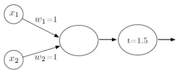
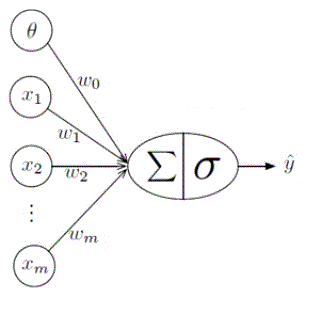
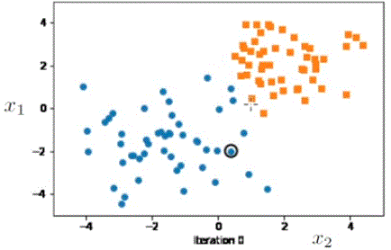
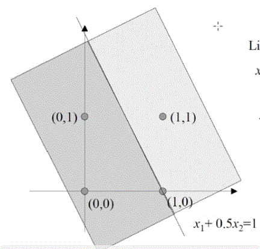

# Deep Learn (Aprendizado profundo)

## Perceptron

O modelo perceptron foi construido com base no que se entendia do funcionamento dos neuronios do cerebro.

Um neuronio é apresenta um necleu, dendritios e axionio (conecta o nucle nos dentritios dos outros neuronios)


No perceptron, os dentritios recebem a informação (valores), o nucle processa eles (realiza uma soma ponderada, com pesos diferentes para cada valor, onde o resultado passa por um limiarizador), o axionio transmite a resposta do gerada pelo nucleo 

**Exemplo**: Tendo a entrada ($x_1$ e $x_2$) e saída desejada($y$) apresentada na tabela abaixo:
|$X_1$|	$X_2$|	$y$|
|----|----|-----|
|0|	0|	0|
|0|	1|	0|
|1|	0|	0|
|1|	1|	1|

Podemos construir o perceptron definindo ps pessos para cada entrada ($\omega_1$ e $\omega_2$) e o valor  do limiarizador ($t$).



A equação que descreve o perceptron é 


$
y_0(x_1\times\omega_1+x_2\times\omega_2) \qquad 1 \text{ se } y_0\ge 1,5
\qquad 0 \text{ se } y_0 \leq 1,5
$

Acompanhe o processo para cada uma das quatro entradas.

|Equação|Limiarizar para 1,5|
|-----|:--------:|
|$0*1+0*1 = 0$|0|
|$0*1+1*1 = 1$|0|
|$1*1+0*1 = 1$|0|
|$1*1+1*1 = 2$|1|

# Modelo classico de Rosenblatt's



Este modelo é formado por:
- Entrada: $x_1, x_2, \dots, x_m$
- Pesos: $\omega_1,\omega_1, \omega_2, \dots, \omega_m$
- Função de ativação (ou threshold): $\sigma(z)$
- Bias: $\theta$
- Saida: $\hat y$

Este modelo equivale a equação

$\sigma\left(\sum^m_{i=0}x_i\omega_i\right) = \hat y$

|||
|----|------|
|$\sigma(z) =$|$0, z-\theta \leq 0$|
||$1, z-\theta > 0$|

O código em python equivalente a equação acima é

<spam id="codes/redes_neurais.py/Perceptron using for loop"></spam>

A equação pode ser reescrevida em forma de multiplicação vetorial

$
\sigma\left(\sum^m_{i=0}x_i\omega_i\right) = \sigma\left(X^TW\right) = \hat y
$

O código em python equivalente a equação acima é

<spam id="codes/redes_neurais.py/Perceptron using vector"></spam>

A GPU permite fazer executar estes caculos (for loop e vetorizado) de forma paralela, aumentando a velocidade do código.

# Regra de aprendizado Perceptron 

O objetivo do aprendizado profundo é acha a melhor reta que separa os pontos

A reta é construída fazendo uma interação para cada ponto, onde se o ponto desta do lado correto da reta, ela não é modificada, caso contrario, a reta é modificada para que o ponto fique no lado correto

||
|:--:|
|*Achando melhor linha de separação*|

Este processo é dado pelo seguinte algoritmo
````
for each point (x_1,x_2):
    if prediction==target:
        Do nothing
    else:
        if prediction==0 and target==1:
            Add (x_1,x_2) to weight vector
        if prediction==1 and target==0:
            Subtract (x_1,x_2) to weight vector
````

**Exemplo**: Construindo o perceptron para a entrada ($x_1$, $x_2$ e $x_3$) e saida desejada ($y$) da tabela abaixo.
|$x_1$|	$x_2$|	$x_3$|	$y$|
|----|----|-----|---|
|1|	0|	0|0|
|1|	0|	1|0|
|1|	1|	0|0|
|1|	1|	1|1|

As tabelas abaixo mostra o processo executado para cada epoch. 

* Epoch 1


|Entrada|	$\hat{y}=\sigma(\vec{x}^T\vec{w})$  | Erro	$err=y-\hat{y}$|$\vec{w}=(w_1+err\cdot x_1,w_2+err\cdot x_2, w_3+err\cdot x_3)$ |
|----|----|-----|----|
|-        |	-|	-|$\vec{w}=(0,0)$|
|1        |	$\hat{y}=\sigma(1\times 0+0\times 0 + 0\times 0)=\sigma(0)=0$|	$err = 0-0=0$      |$\vec{w}=(0+0\times 1,0+0\times 0,0+0\times 0)=(0,0,0)$|
|2        |	$\hat{y}=\sigma(1\times 0+0\times 0 + 1\times 0)=\sigma(0)=0$|	$err = 0-0=0$      |$\vec{w}=(0+0\times 1,0+0\times 1,0+0\times 1)=(0,0,0)$|
|3        |	$\hat{y}=\sigma(1\times 0+1\times 0 + 0\times 0)=\sigma(0)=0$|	$err = 0-0=0$      |$\vec{w}=(0+0\times 1,0+0\times 1,0+0\times 0)=(0,0,0)$|
|4        |	$\hat{y}=\sigma(1\times 0+1\times 0 + 1\times 0)=\sigma(0)=0$|	$err = 1-0=1$      |$\vec{w}=(0+1\times 1,0+1\times 1,0+1\times 1)=(1,1,1)$|

* Epoch 2

|Entrada|	$\hat{y}=\sigma(\vec{x}^T\vec{w})$  | Erro	$err=y-\hat{y}$|$\vec{w}=(w_1+err\cdot x_1,w_2+err\cdot x_2, w_3+err\cdot x_3)$ |
|----|----|-----|----|
|1|	$\hat{y}=\sigma(1\times 1+0\times 1 + 0\times 1)=\sigma(1)=1$|	$err = 0-1=-1$|$\vec{w}=(1-1\times 1,1-1\times 0,1-1\times 0)=(0,1,1)$|
|2| $\hat{y}=\sigma(1\times 0+0\times 1 + 1\times 1)=\sigma(1)=1$|	$err = 0-1=-1$|$\vec{w}=(0-1\times 1,1-1\times 0,1-1\times 1)=(-1,1,0)$|
|3| $\hat{y}=\sigma(1\times (-1)+1\times 1 + 0\times 0)=\sigma(0)=0$|	$err = 0-0=0$|$\vec{w}=((-1)+0\times 1,1+0\times 1,0+0\times 0)=(-1,1,0)$|
|4| $\hat{y}=\sigma(1\times (-1)+1\times 1 + 1\times 0)=\sigma(0)=0$|	$err = 1-0=1$|$\vec{w}=((-1)+1\times 1,1+1\times 1,0+1\times 1)=(0,2,1)$|

* ...

* Após a Epoch 5
    * $w_0 = -2$
    * $w_1 = 2$
    * $w_2 = 1$

Normalizando para 1 tem-se $w_0=-1$,$w_1=1$ e $w_2=0,5$. A imagem abaixo mostra a divisão de decissão do classificador.

||
|:--:|
|*Região de decisão obtida*|

A superficie de decisão é obtida atraves da equalção da reta $y=ax+b$ ou $y-ax-b=0$ para representar a operação $\hat{w}^T\hat{x}=0$. Se o vetor peso for $\hat{w}=(-b,-a,1)$ e o vetor entrada $\hat{x}=(1,x,y)$ pode-se repesentar a operação vetorial como uma equação de reta. (nesta equação $y$ da equação não é o resultado do perceptron)

$\hat{w}^T\hat{x}=-b\times 1+(-a)\times x + 1\times y$

$\hat{w}^T\hat{x}=-b+(-a)x+y$

Para o exemplo (lembrando que $w_0=\theta$)

$\hat{w}=(w_0,w_1,w_2)=(-b,1,-a)=(-1;1;0,5)$

$\hat{x}=(x_1,x_2,x_3)=(1,x,y)=(1,x_2,x_3)$

então a equação da reta é 

$-b+(-a)x+y=0$

$1+(0,5)x_2+x_3=0$

$\dfrac{x_2}{2}+x_3=1$

Segue o código do perceptron

<spam id="codes/redes_neurais.py/Code full Perceptron"></spam>

* **Theorema Convergencia do Perceptron**: se os dados forem linearmente separeveis, o perceptron sempre vai convergir, ou seja, contruir uma reta que consiga separar os dados.

O objetivo do perceptron não é obter a magnitude do vetor $\hat{w}$, mas sim seu angulo. Assim, a escala de $\hat{w}$ não é importante, mas se for utilizado valores muito grandes, a convergencia ira demorar. Por isso, é preferivel escalar $\hat{w}$ e $\hat{x}$ para valores proximos de 0.

Desvantagens do perceptron:

*  Classificar linear (so pode seperar congunto usando uma reta);
*  Classificar binario (so pode classificar entradas para duas classes);
*  Não ira convergir se as classes não forem linearmente separaveis;
*  Ele pode achar uma região de decisão que não é uma "otima" solução;

# Algebra Linear

Tensor é um vetor que tensiona a região de decisão.
* **Escalar**: qualquer numero real, ex: $x=1$, é um tensor de rank 0;
* **Vetor**: conjunto de $n$ numeros reais ex: $\hat{x}=(x_1,x_2,...,x_n)$, é um tensor de rank 1;
* **Matriz**: conjunto de $m\times n$ numero reais dispostos en linhas e colunas, ex: 

$**X**=\left[x_{1,1} x_{1,2} ... x_{1,n}
x_{2,1} x_{2,2} ... x_{2,n}
... ... ... ...
x_{m,1} x_{m,2} ... x_{m,n}
\right]$

,é tensor de rank 2;

* **Matriz design**: é nome dado a matriz contendo  $n$ caracteristicas de $m$ amostras;

* **3D Tensor**: são varias matrizes, por exemplo uma imagem com tres canais de cores, é importante para usar o paralelismo de processamento e quacionamento vetorial;

# Pytorch vs Numpy

Os dois são bibliotecas do python usados para criação e manipulação de vetores. Mas é preferivel usar o Pytorch porque PyTorch tem suporte a GPU (permite carregar dados e modelos usando a memoria da GPU) (GPU permite o melhor parelilismo), também apresnta diferenciação automatica (faz regra da cadeia de forma automatica), ja apresenta mulitcas função de Deep Learn
