# Redes de Computadores 

## Introdução

**Internet**: a ligação entre diversos computadores espalhados pelo mundo. Realiza a troca de mensagens, imagens, arquivos etc.

**Rede**: é um conjunto de equipamentos que podem se comunicar e trocar informações. Permitindo a comunicação e compartilhar recursos.

**Rede de computadores**: conexão entre dois ou mais computadores. Conexão por meio de cabos e conexão sem fio, também chamada de wireless.

## Tipos de Redes

### Rede Local (LAN)

 São interconexão de equipamentos em **espaço normalmente limitado**. Usado em residências, empresas, escolas etc.

| 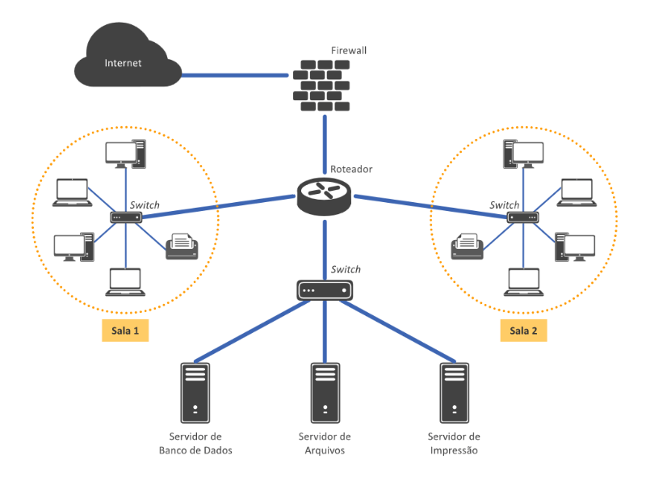 |
| :-----------------------: |
|        *Rede LAN*         |

### Rede metropolitana (MAN)

Interligam computadores em grandes centros urbanos, em áreas maiores do que as redes locais.

| 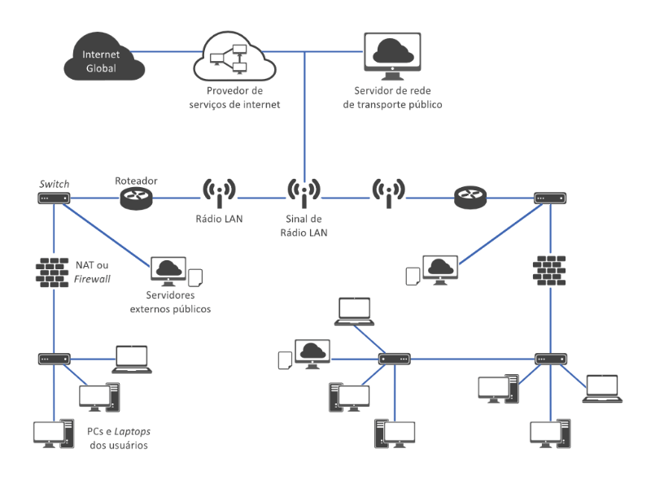 |
| :-----------------------: |
|        *Rede MAN*         |

### Rede geograficamente distribuída (WAN - *Wide Area Network*)

 Conectar computadores próximos ou muito distantes, sem limitação de distância. Cidades distantes ou até mesmo em outros países e continentes

| 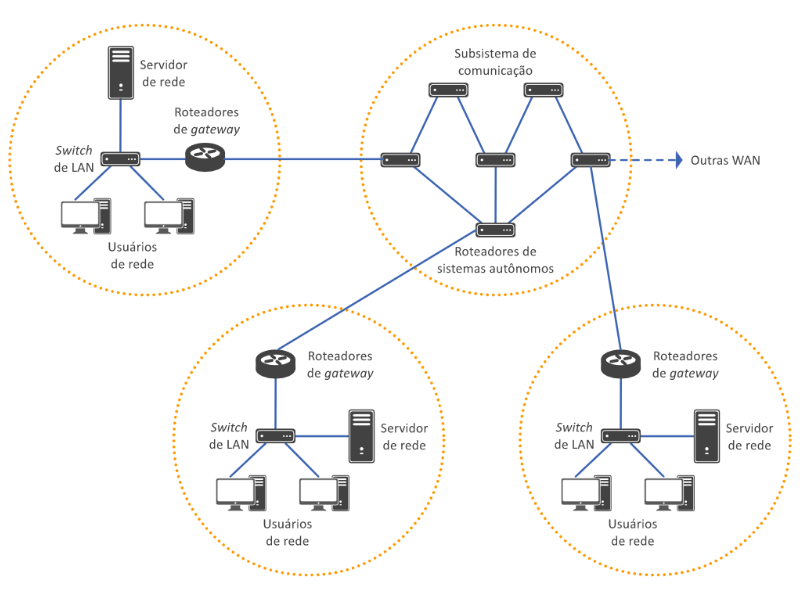 |
| :-----------------------: |
|        *Rede WAN*         |

## Tipos de Conexão

* **Dial-Up** (acesso discado):  usa a rede pública de telefonia para acessar a internet. Era caro e lento;

* **Banda Larga**: pode ser oferecido: 

    * **ADSL** :  por uma operadora de telefonia fixa;
    * **Cable Modem** :  por uma operadora de telefonia fixa;
    * **Rádio e Satélite**:   por uma operadora de rádio.

* **Sem fio**: rádios e satélites e faz uso das redes baseadas em ondas eletromagnéticas. baseadas em redes celulares 3G/4G.

 Os cabos, os fios, as antenas e as ondas eletromagnéticas levam/transportam as informações nas redes.

 * **Largura de banda**:  limite na comunicação entre equipamentos. Quanto mais larga, maior será a capacidade de transmissão.

## Meios de transmissão Guiados

* **Par trançado**: mais utilizado e antigo.  é composto de pares de fios de cobre entrelaçados. Eles apresentam baixo custo de manutenção.
 |  |
 | :--------: |
 |     **     |

* **Cabo Coaxial**: é um fio de cobre esticado, na parte central do cabo, recoberto por um material isolante
| 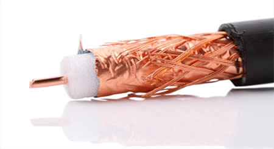 |
| :-------------------------------: |
|          *Cabo Coaxial*           |

* **Fibras ópticas**:sistema mais moderno de transmissão de dados. O sistema é formado por uma fonte de luz, um meio de transmissão e um detector (componente eletrônico capaz de detectar a luz)
|  |
| :--------: |
|     **     |

### Fibra Óptica
Um sistema de transmissão de dados em apenas uma direção (unidirecional) é formado de  uma fonte de luz em uma de suas extremidades e um detector na outra. Recebe um sinal elétrico, converte esse sinal e o transmite na forma de pulsos de luz. Na extremidade de recepção, a saída é reconvertida em um sinal elétrico.

As fibras ópticas são feitas de vidro bastante transparente. Essa propriedade é que permite a transmissão da luz.

cabos de fibra óptica são bem parecidos com os cabos coaxiais. No centro, fica o núcleo de vidro ( com espessura de um fio de cabelo ) através do qual se propaga a luz. . Em volta há uma cobertura de plástico fino que protege o revestimento interno.

| 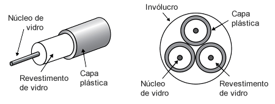 |
| :----------------------: |
|         *Fibra*          |

Os cabos de fibra terrestre são colocados no solo, a um metro da superfície. Em regiões litorâneas, são enterrados em trincheiras. Nos oceanos, eles são depositados no fundo.

A fibra óptica permite maior largura de banda, não desperdiça luz e os cabos dificilmente são danificados. Enquanto os fios de cobre precisam de repetidores, que ampliam a intensidade do sinal a cada 5 quilômetros, a fibra óptica só utiliza repetidores a cada 50 quilômetros.

A fibra óptica também tem a vantagem de não ser afetada por picos de voltagem, interferência eletromagnética ou quedas no fornecimento de energia, não sofre a ação corrosiva de alguns elementos químicos que pairam no ar, além de adaptar-se muito bem a ambientes industriais desfavoráveis.

A principal desvantagem da fibra óptica está no fato de ser uma tecnologia menos conhecida, que exige competência técnica que nem todos os engenheiros possuem. Também podem ser danificadas com facilidade se forem encurvadas demais.

As empresas telefônicas usam a fibra óptica por ser muito mais leve que o cobre e ocupar bem menos espaço. Outro ponto que facilita a transição entre cabos de cobre e a fibra, é que o cobre pode ser revendido para refinarias

## Meios de transmissão não guiados

Os  transmissão com fio possuem limitação física(tem limite do volume de informações que podem transportar).

Transmissão sem fio é feita por meio de antenas, como as de TV ou telefone celular. Essas antenas transmitem ondas eletromagnéticas no espaço livre (ar) para um receptor (localizado em um ponto distante)

* **Ondas de rádio**: ão fáceis de gerar, podem percorrer longas distâncias e adentrar facilmente nos prédios. É omnidirecional (transmitida por todas as direções), assim O transmissor e você não precisam estar alinhados.

* **Micro-ondas**:  ocorre em linha reta, é mais barato. Não atravessa muito bem limites físicos, como paredes de edifícios. é usado nos telefones celulares

* **Infravermelho**: é próprio para comunicação de curto alcance. É usado no controle remoto. Não atravessar objetos sólidos

* **Ondas de luz**:  utiliza raios laser, é fácil de ser instalada. Uma aplicação é instalar  para conectar LANs de dois predios com laser instalados no telhado

* **Satélites**: liga um ou mais transmissores fora da atmosfera a receptores na Terra. Existem dois tipos de satélites: os **geoestacionários** ficam a 36 mil quilômetros acima da superfície terrestre e estão parados em relação a um ponto na Terra; os **satélites de baixa altitude** ficam girando em torno do nosso Planeta.

# Formas de Transmissão de Dados 

As formas de transmissão tem o objetivo de aumentar a velocidade da transmissão dos dados e Maximizando o uso do canal.

* **Transmissão Simplex**: transmissão básica,  a transmissão pode ocorrer apenas em uma direção. Não há meios de verificar a recepção dos dados. Problemas na transmissão não são corrigidos. Um exemplo é a transmissão da TV aberta.

* **Transmissão Half-Duplex**: a transmissão pode ocorrer em ambas as direções, mas não ao mesmo tempo. A detecção de erros é possível. Exemplo: *walkie-talkies*.

* **Transmissão Full-Duplex**: melhor forma de transmissão. Os dados podem ser transmitidos e recebidos simultaneamente. Exemplos: TV a cabo que possui internet internet.

# LANS

LANs são rede localizadas em um único edficio (casa, escritorios, etc)

## Topologia 

Topologia pe a formas como os equipamentros estão conectados entre si.

### Topologia em Anel

Os computadoes estão ligados em anel. Cada computador esta ligado a somente dois outros. A desvantegem dasta topologia é que se uma maquina, toda a rede pode cair.

|  |
| :---------------------: |
|   *Topologia em Anel*   |

### Topologia em Barramento

Nesta topologia todos os computadores estão conectados no mesmo ponto. A desvantangem desta topologia é que somente um computadore pode venviar informação por vez, ou seja, em quanto um fala os outros são barrados.

| 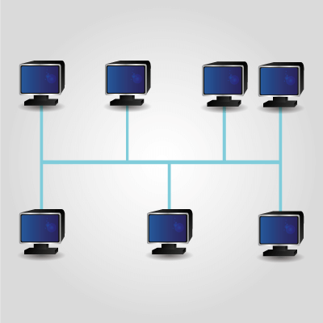 |
| :---------------------------: |
|   *Topologia em Barramento*   |

### Topologia em Estrela

Nesta tipo de rede todos os computadores estão conectados  a  um dispositivo chamado *switch* que tem a função de gerenciar a comunicação. Assim todos os computadores podem comunicar-se entre diretamente e com outros computadores remotos (em outra rede). A sua vantagem é que se um computador parar a rede não ira cair, por isso esta topologia é a mais usada.

| 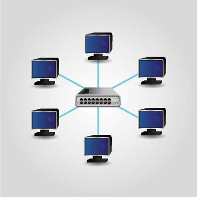 |
| :------------------------: |
|   *Topologia em Estrela*   |

# Placa de Rede

| 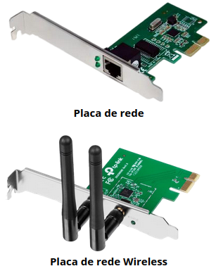 |
| :---------------------------: |
|        *Placa de rede*        |
E um *hardware* que permite a troca de informações entre os conputadores, controlando o realizando o envia e recebimento de dados. As placas podem ser classificadas em função de três caracteristicas:
* Taxa de transmissão: 
  * Ethernet, com velocidades de 10Mbps ate 10.000 Mbps;
  * Token Ring, com velocidades de 4Mbps ate 300 Mbps;
  * Wi-Fi, com velocidades de 2Mbps ate 9,6 Gbps;
  * Fibra optica, com velocidades de 100 Mbps a 300 Mbps.
* Cabos de rede suportados:
  * Ehternet usão cabo par trançado e coaxial;
  * Token Ring usa par trançado;
  * Fibra óptica.
* Barramento:
  * ISA (*Industry Standard Architecture*);
  * PCI (*Peripheral Component Interconnect*);
  * PCI-X (*Peripheral Component Interconnect Extended*);
  * AGP (*Accelerated Graphics Port*);
  * PCI Express (mais comum atualmente);
  * AMR, CNR e ACR;
  * VESA (VESA *Loca Bus*);
  * MCA (*Micro Channel Architecture*);
  * EISA (*Extended Industry Standard Architecture*).

# Conectores

## *HUB* ou concentrador

É um ponto central que interliga diversos computadores. Ele permite que novos computadores sejam adicionados a rede sem que a mesma tenha que ser desligada. O hub é um componente antigo que tem como caracteristica negativa repassar um dado para todos os computadores da rede, gerando trafego e problemas de segurança. Usado em LANs.

## *Swith* ou comutador

Tem a mesma função do *hub*, mas ele repassa a informação somente para um computador (destinatário final). Alguns modelos de swith podem sete ate 48 portas. Usado em LANs.
| 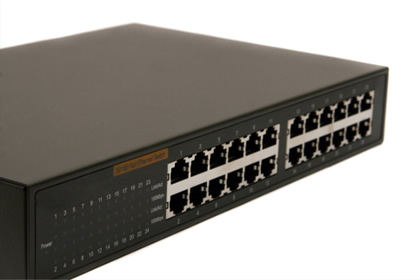 |
| :-----------------------: |
|   *Switch de 24 portas*   |

## Roteador

Tem a função de conetar grande redes, exercendo o mesmo papel do switch e com o adicinal de conseguir escolher a melhor rota de transmissão dos dados ate chegar no destinatario, aumentando a velocidade de comunicação e reduzindo a perca de dados.

## Repetidor de sinal

Sua função é receber pacotes (dados) e repetilos sem realizar qualquer gerenciamento, amplificando o sinal, permitindo alcançar grandes distânicas

## *Gateway*

O *gateway* tem a função de interpretar e fazer o intercanbio os diversos protocolos e arquiteturas que estão presentes na rede.

# Cabeamento

O cabeamento de um pedrio tem a função de disponibilizar pontoes de rede em todos os lacais em forem necessarios ao redor do predio. Estes pontos se encontraram em uum ponto central onde ficam os equipamentos de rede como roteadores e switches.

| 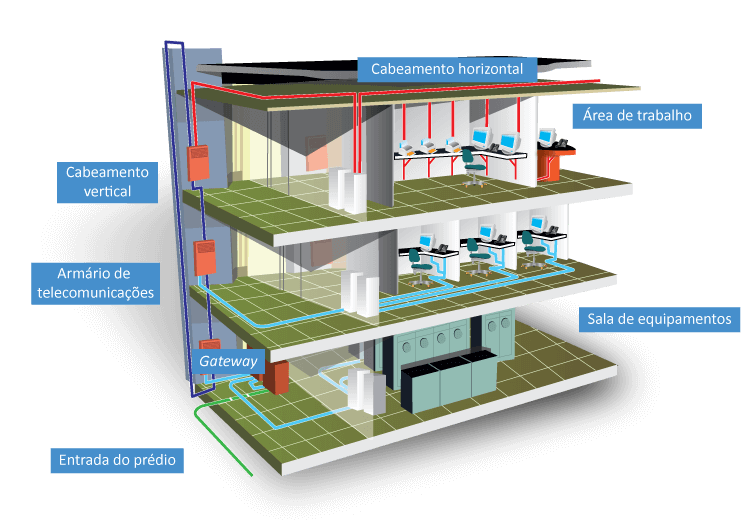 |
| :---------------------------------------: |
|       *Cabeamento estruturado.png*        |

* Entrada do prédio: é o encontro da rede da rua com a do prédio
* *Gateway*: permite a comunicações entre duas redes diferentes
* Armário de telecomunicações (AT): desle sain cabos que vão até os pontos de rede. 
* Cabeamento horizontal: conecta o AT os pontos de rede
* Cabeamento vertical: faz a ligação entre os ATS de cada Andar. Os ATs são ligados a um *switch* na sala de equipamentos. 
* Área de trabalho: são as salas onde então localizados os computadores
* Sala de equipamentos: sala onde ficam os *swithces* e roteadores.

A nomeclatura ponto de rede não esta de acordo com ABNT NBR 14565:2012, que define ponto de telecomunicações, pois o ponto também é usado pode ser usado para telefonia.

O cabo UTP é o usado na redes, não tendo blindagem. Possuem 7 

| Categorias | Velocidade | Numero de fios | Diferenças                                                                                                  |
| :--------- | :--------- | :------------- | :---------------------------------------------------------------------------------------------------------- |
| 1          | -          | -              | transporta somente voz                                                                                      |
| 2          | 4 Mbps     | 4              | -                                                                                                           |
| 3          | 14 Mbps    | 4              | desenvolvido para uso em redes, ainda são usados em instalçações telefonicas                                |
| 4          | 20 Mbps    | 4              | -                                                                                                           |
| 5          | 100 Mbps   | 4              | -                                                                                                           |
| 5e         | 1 Gbps     | 4              | Desenvolvida para reduzir interferencias, perdas de sinal, aumentando a distancia de conexão até 100 metros |
| 6          | -   | -              | alcance maximo de 100 metros, por isso apresentão poucas vantagens|
| 6a (*ampliado*)          | 10G   | -              | resistente a interferências, os RJ-45 para 6a e 5 são diferentes|
| 7          | -   | -              | cabeamento metálico ainda em desenvolvimento, ps cabos ópticos são mais aconcelhaves|

## Cabeamento estruturado

A vantagem dos cabos metalicos sobre os cabos ópticos é a sua maior facilidade de cripagem. A dinstancia maxima de conexção que este cabeamento permite é 100 m. Para conectar computadoes com distancia maior de 100 m use swiths como repetidores.

Para clipar um cabo é necessario usar um alicate de crimpagem. Sua boca faz com que chapas metalicas do cenetor perfurem a cobertura plastica do foi perndendo-o e fazendo o contato eletrico. Primeiro descasque o cabo e liberte os 8 fios tomando cuitado para não danificar sua proteção plastica, ordene-os pelas cores conforme o padrão (T568A ou T568B) escolido, eles devem ficar retos e com o mesmo comprimento (corte a extremidade para isso), insireos no conetor e use o alicate para precinar as chapas.

A interferencias externas são reduzidas pela parte trançada do cabo, portanto quanto menor a parte destrançada, melhor a vulnerabilidade da interferencias (sem exageros)

| 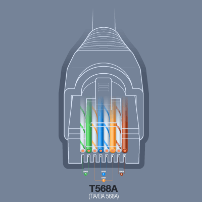 |
| :---------------------------------------: |
|       *T568A*        |

| 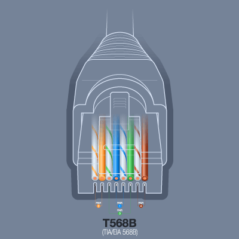 |
| :---------------------------------------: |
|       *T568B*        |

Os testadores de cabos podem ser usado para verificar a continuidade dos fios (modelos mais simples) ou a qualidade do cabeamento (modelos mais sofisticados)

* Cabo *Straight* (reto): quando as estremidades de um cabo seguem o mesmo padrão de clipagem, sendo o mais comum.
* Cabo *CROSS-OVER*: quando as estremidades de um cabo temo padrões de clipagem diferentes, usado para ligar dos micros.

# Protocolos de Rede

Protocolo é uma forma de linguagem  de comunicaçõa eletrônica que define  as regras que controlam o envio e o recebimento de pacotes de informalção, permitindo que a informação enviada seja entendida.

Os cabos e antenas são veiculos que tranportam estes pacotes (informação).

O proticolo de controle de Transmissão (TCP) e p Protocolo da Internet (IP) são os mais usados e trabalham em conjunto. O TCP constrola a forma de transmissão e o IP o formato.

As arquiteuras de redes são padronizados pelo IETF (Internet Engineering Task Force) para que aja conpatilidade de equipamentos de fabricantes diferentes.

## Arquitetura de Rede

a Organização Internacional para Padronização (ISO) criou um modelo conhecido como Modelo de Referências para Sistemas de Interconexão Abertos para dividir a rede em camadas, onde a informação deve passar por cada uma até chegar no destino final

A divisao ISO é apresentada abaixo

* 7 - Aplicação : esta camada é a interface entre o usuario e a rede (o navegador por exemplo);

* 6 - Apresentação : transfoma os dados para que a camada de aplicação possa entender;

* 5 - Sessão : ajuda a garantir a entrega das mensagens ao definir caminhos possiveis de serem percorridos na camada de transporte;

* 4 - Transporte : ajuda a camada de rede a garantir que a mensagem seja transmitida sem erros, perdas ou duplicações;

* 3 - Rede : decide qual caminho fisico a mensagem deve percorrer pensando na prioridade de nevio e outros fatores referente a camada de enlace;

* 2 - Enlace : detecta e corrige erros que ocorrem na camada física;

* 1 - Físico : é a conecção eletrica (cabos metalicos) ou eletromagnetica (antenas, fibra óptica) entre a origem e o destino. nesta camada os dados são convertidos em bits para que possam ser tansportados.

## Protocolo TCP/IP

O TCP/IP usa apenar quatro camadas:

* 7 - Aplicação : esta camada é a interface entre o usuario e a rede (o navegador por exemplo);

* 6 - Apresentação : transfoma os dados para que a camada de aplicação possa entender;

* 5 - Sessão : ajuda a garantir a entrega das mensagens ao definir caminhos possiveis de serem percorridos na camada de transporte;

* 4 - Transporte : ajuda a camada de rede a garantir que a mensagem seja transmitida sem erros, perdas ou duplicações;

* 3 - Rede : decide qual caminho fisico a mensagem deve percorrer pensando na prioridade de nevio e outros fatores referente a camada de enlace;

* 2 - Enlace : detecta e corrige erros que ocorrem na camada física;

* 1 - Físico : é a conecção eletrica (cabos metalicos) ou eletromagnetica (antenas, fibra óptica) entre a origem e o destino. nesta camada os dados são convertidos em bits para que possam ser tansportados.

As maquinas de origem e destino apresentam um endereço IP para a sua indentificação, ele é único para cada maquina.

Pacotes são blocos de informação contendo cabeçalho (informações do destinatario e remetente) e o dado da mensagem. Toda vez que eese pacote chega em um roteador é verificado o endereço de destino para que o pacote possa ser encaminhado corretamente.

*Host*: é qualquer maquina conectada a uma rede que ofereçe recursos ao usuario.

Os retoeadoes estão intercinectados na rede. Eles tem a função de entregar o pacote para o proximo roteador ou par o prorio destinatario. A escolha do proximo roteador que o pacote deve ser enviado é a escolha do melhor caminho, que é feita de forma automatica usando protocolos de roteamento.

O IP versão 4 apresenta 8 *bits*, ou seja, quatro números de 0 a 255 separados por pontos.

Os endereções IP são divididos em classes:
* Classe A: primeiro numero referese a rede e os demais as maquinas;
*  Classe B: dois primeiros numero referese a rede e os demais as maquinas
*  Classe C: três primeiros numero referese a rede e o ultimo as maquinas. Assim endereços da classe C são usados por pequenas redes (com no maximo 256 maquinas).

A tabela abaixo mostra a divisão dos endereções.

|  |
| :---------------------------: |
|  *Classes dos Endereções IP*  |

*Loopback*: é uma interface com IP 127.X.X.X (ou 127.0.0.1)  que não é conectada a nenhuma rede. Ela tem a função de primitir testar a comunicaçõa interprocessos dentro da mesma máquina

Existem endereções reservados para a utilização da rede interna. Estes são vistos abaixo.

|  |
| :---------------------------: |
|  *IPs não validos na internet*  |

A mascara é um outro conjunto de quatro numeros que permite dizer se o endereço IP pode ser de maquina ou de rede.

**Exemplo**: Quains são as mascaras possiveis para o endereço IP classe C 200.241.16.X?
Os endereções de  IP pode ser  de: 200.241.16.0 à 200.241.16.255, mas deve-se tirar os extremos. Então endereços válidos são: 200.241.16.1 à 200.241.16.254. Logo o endereço de rede seria então: 200.241.16.0.

 * O IP estático so pode ser mudado de forma manual
 * O IP dinamico muda toda vez que o computador se conecta a rede

A distribuição dos IPs é realizada peo protocolo DHCP (*Dynamic Host Configuration Protocol*)

O serviço DNS (*Domain Name System* – Sistema de Nome de Domínio)
faz a associação do endereço IP cp, a url de um link, tornando o acesso do usuario à rede mais facil.

Exite um servidos com todas estas associações, onde todas as outras maquinas devem acessalo para poder traduzir as url para IP. Toda nova maquina deve ser cadastrada neste grande banco de dados. Cada Região tem seu proprio banco de dados, no Brasil é responsabilidadeo do Registo.bre